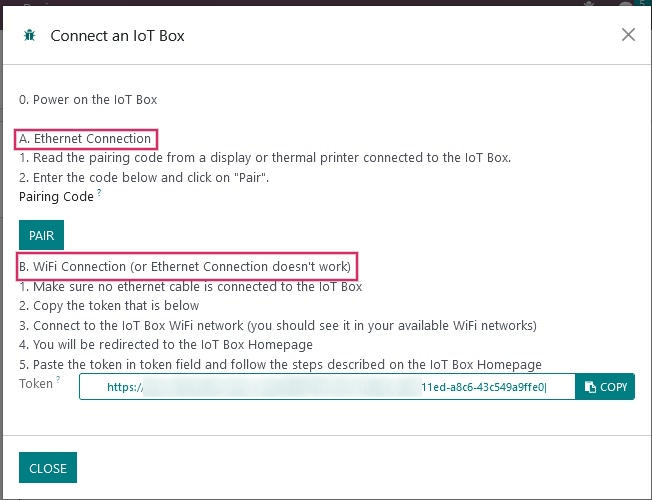
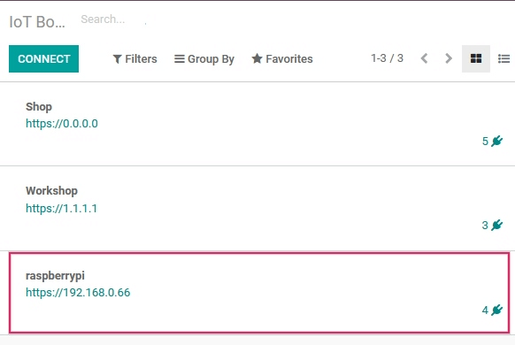

============================================================
Connect an Internet of Things (IoT) Box to the Odoo database
============================================================

The Internet of Things (IoT) box is a micro-computer device that allows for the connection of
devices to a Odoo database. A subscription is required in order to use the
:abbr:`IoT (Internet of Things)` box.

Install the :menuselection:`Internet of Things (IoT)` App on the Odoo database.

.. image:: connect/connect01.png
   :align: center
   :alt: The Internet of Things (IoT) App on the Odoo database.

Go to the :menuselection:`IoT` App and click on :guilabel:`Connect` on the
:abbr:`IoT (Internet of Things)` IoT Boxes page.

.. image:: connect/connect09.png
   :align: center
   :alt: Connecting an IoT box to the Odoo database.

Follow the steps to connect the IoT Box either via wired ethernet connection or via WiFi.

.. note::
   Ensure the :abbr:`IoT (Internet of Things)` box is flashed with the most up-to-date
   :abbr:`IoT (Internet of Things)` image.

Ethernet Connection
===================

#. Connect all the devices that have to be connected with cables to the
   :abbr:`IoT (Internet of Things)` box (ethernet, :abbr:`USB (Universal Serial Bus)` devices,
   etc.).

#. Power on the :abbr:`IoT (Internet of Things)` Box.

#. Read the :guilabel:`Pairing Code` from a screen or a receipt printer connected to the
   :abbr:`IoT (Internet of Things)` Box.

   .. note::
      If no screen is attached to the :abbr:`IoT (Internet of Things)` box then the pairing code can
      be accessed from the :abbr:`IoT (Internet of Things)` box admin console by clicking on
      :guilabel:`POS Display`. For instructions on how to access the admin console, visit
      :ref:`iot_connect/token`

#. Input the :guilabel:`Pairing Code` on the :abbr:`IoT (Internet of Things)` app of the database
   and click on the :guilabel:`Pair` button.

WiFi Connection
===============

#. Connect all the devices that have to be connected with cables to the
   :abbr:`IoT (Internet of Things)` box (ethernet, :abbr:`USB (Universal Serial Bus)` devices,
   etc.).

#. Power on the :abbr:`IoT (Internet of Things)` Box.

#. Copy the :guilabel:`Token` from the :guilabel:`WiFi connection` section in
   :menuselection:`IoT` app of the Odoo database.

#. Connect to the :abbr:`IoT (Internet of Things)` Box WiFi Network (make sure there is no ethernet
   cable plugged into the computer).

   .. image:: connect/connect-iot-wifi.png
      :align: center
      :alt: WiFi networks available on the computer.

#. Upon connecting to the :abbr:`IoT (Internet of Things)` Box WiFi, a browser will automatically
   redirect to the :abbr:`IoT (Internet of Things)` Box Homepage. Give a name to the
   :abbr:`IoT (Internet of Things)` Box, paste the previously copied token into the
   :guilabel:`Server Token` field, and then click on :guilabel:`Next`.

   .. image:: connect/server-token.png
      :align: center
      :alt: Enter the server token into the IoT box.

   .. note::
      If the :abbr:`IoT (Internet of Things)` Box WiFi connection wizard doesn't start, see
      :ref:`iot_connect/token`.

#. Choose the WiFi network that the :abbr:`IoT (Internet of Things)` box will connect with (enter
   the password if there is one) and click on :guilabel:`Connect`. Wait a few seconds before being
   redirected to the database. The computer may need to be manually connected back to WiFi.

   .. image:: connect/configure-wifi-network-iot.png
      :align: center
      :alt: Configuring the WiFi for the IoT box.

The :abbr:`IoT (Internet of Things)` box should appear in the :menuselection:`IoT` app of the
Odoo database.

.. important::
   A manual reset of the :abbr:`IoT (Internet of Things)` box may be necessary upon successfully
   connecting the :abbr:`IoT (Internet of Things)` box via WiFi for the :abbr:`IoT
   Internet of Things)` box to appear in the :menuselection:`IoT` app of the Odoo database.

.. _iot_connect/token:

Manually connecting the IoT with the token
==========================================

A manual connection of the :abbr:`IoT (Internet of Things)` box to the :menuselection:`IoT
(Internet of Things)` app can be made with the :guilabel:`token`. The :guilabel:`token` can be
found after clicking on :guilabel:`Connect` in the :menuselection:`IoT` app. The
:guilabel:`token` will be inputted into the :abbr:`IoT (Internet of Things)` box admin console.

#. Access the :abbr:`IoT (Internet of Things)` box admin console by entering the :abbr:`IP
   (Internet Protocol)` address of the :abbr:`IoT (Internet of Things)` box into a browser window.

.. note::
   The :abbr:`IP (Internet Protocol)` address can be accessed by the router the :abbr:`IoT
   (Internet of Things)` box is connected to or by connecting a printer to the :abbr:`IoT
   (Internet of Things)` box (a receipt will print out with the :abbr:`IoT (Internet of Things)`
   box's :abbr:`IP (Internet Protocol)` address on it).

#. Enter the :guilabel:`token` under the :guilabel:`Server` section by clicking on
   :guilabel:`Configure`.

#. Paste the :guilabel:`token` into the :guilabel:`Server Token` field and click
   :guilabel:`Connect`.

IoT Box Schema
==============

Raspberry Pi 4
--------------

   Odoo IoT box (Raspberry Pi 4) schema with labels.

Raspberry Pi 3
--------------

   Odoo IoT box (Raspberry Pi 3) schema with labels.
