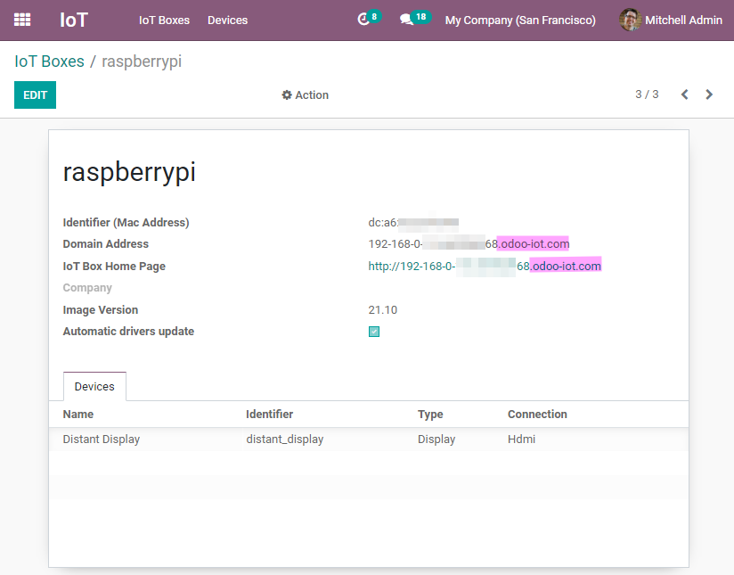
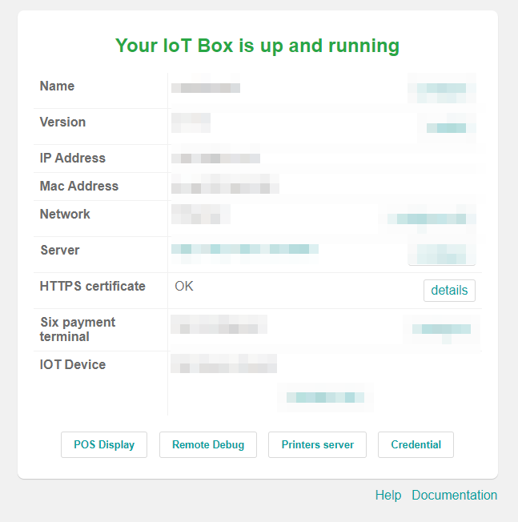

=======================
HTTPS certificate (IoT)
=======================

What is HTTPS?
==============

*Hypertext Transfer Protocol Secure* (HTTPS) is the secure version of *Hypertext Transfer Protocol*
(HTTP), which is the primary protocol used to send data back and forth between a web browser and a
website. :abbr:`HTTPS (Hypertext Transfer Protocol Secure)` is encrypted in order to increase the
security of data transfer.

:abbr:`HTTPS (Hypertext Transfer Protocol Secure)` uses an encryption protocol to encrypt
communications. The protocol is called *Transport Layer Security* (TLS), although formerly it was
known as *Secure Sockets Layer* (SSL).

:abbr:`HTTPS (Hypertext Transfer Protocol Secure)` occurs based upon the transmission of
:abbr:`TLS (Transport Layer Security)`/:abbr:`SSL (Secure Sockets Layer)` certificates, which verify
that a particular provider is who they say they are.

.. note::
   In this documentation and Odoo we will use the term "HTTPS certificate"
   to define the fact that the SSL certificate is valid and allows
   :abbr:`HTTPS (Hypertext Transfer Protocol Secure)` connection.

Why is it needed?
=================

In order to communicate with certain network devices (in particular payment terminals), the usage of
:abbr:`HTTPS (Hypertext Transfer Protocol Secure)` is mandatory. If the
:abbr:`HTTPS (Hypertext Transfer Protocol Secure)` certificate isn't valid, some devices won't be
able to interact with the :abbr:`IoT (Internet of Things)` Box.

How to have obtain a Hypertext Transfer Protocol Secure (HTTPS) certificate
===========================================================================

The generation of the :abbr:`HTTPS (Hypertext Transfer Protocol Secure)` certificate is automatic.

The :abbr:`IoT (Internet of Things)` Box will send a specific request to `<https://www.odoo.com>`__
that will send back the :abbr:`HTTPS (Hypertext Transfer Protocol Secure)` certificate if the
:abbr:`IoT (Internet of Things)` box and database are eligible.

Internet of Things (IoT) eligibility
------------------------------------

 #. The database should be a **production** instance.
    The database instance should not be a copy, a duplicate, a staging or a development environment.
 #. The Odoo subscription must have an "IoT Box Subscription" line.
    If you are unsure if there is an "IoT Box Subscription" line, contact your Account Manager or
    Partner.

Troubleshooting
===============

If anything goes wrong during the process of the :abbr:`HTTPS (Hypertext Transfer Protocol Secure)`
certificate generation or reception, a specific error will code be given on your
:abbr:`IoT (Internet of Things)` box home page.

 .. tip::
    If there was an error during the process, refreshing the :abbr:`IoT (Internet of Things)` box
    home page will force to regenerate the :abbr:`HTTPS (Hypertext Transfer Protocol Secure)`
    certificate. This should be the first step that is taken during the troubleshooting process.

Hypertext Transfer Protocol Secure (HTTPS) certificate errors
-------------------------------------------------------------

`ERR_IOT_HTTPS_CHECK_NO_SERVER`
~~~~~~~~~~~~~~~~~~~~~~~~~~~~~~~

Reason:
    The configuration regarding the server is missing.

Solution:
    Ensure that the server is configured.

.. seealso::

   :doc:`connect`

`ERR_IOT_HTTPS_CHECK_CERT_READ_EXCEPTION`
~~~~~~~~~~~~~~~~~~~~~~~~~~~~~~~~~~~~~~~~~

Reason:
    An unhandled error happened when trying to read the existing
    :abbr:`HTTPS (Hypertext Transfer Protocol Secure)` certificate

Solution:
    Ensure that the :abbr:`HTTPS (Hypertext Transfer Protocol Secure)` certificate file is readable.

`ERR_IOT_HTTPS_LOAD_NO_CREDENTIAL`
~~~~~~~~~~~~~~~~~~~~~~~~~~~~~~~~~~

Reason:
    The contract and/or database :abbr:`UUID (Universal Unique Identifier)` is missing.

Solution:
    Ensure that both values are configured as intended.
    To modify them, go to the :abbr:`IoT (Internet of Things)` box home page, then navigate to
    :guilabel:`Credential`

`ERR_IOT_HTTPS_LOAD_REQUEST_EXCEPTION`
~~~~~~~~~~~~~~~~~~~~~~~~~~~~~~~~~~~~~~

Reason:
    An unexpected error happened when the :abbr:`IoT (Internet of Things)` box tried to reach
    `<https://www.odoo.com>`__. The causes are likely related to the network
    infrastructure/configuration:

     - The :abbr:`IoT (Internet of Things)` box does not have access to internet.
     - The network does not allow the :abbr:`IoT (Internet of Things)` box to communicate with
       `<https://www.odoo.com>`__.
       This may be due to network devices preventing the communication ( firewalls, etc.) or network
       configuration (:abbr:`VPN (Virtual Private Network)`, etc.).

    .. warning::
        Make sure to see this issue with your system administrator or network responsible employee
        if you have any.
        As this error code depends on the network infrastructure, it goes beyond support service
        scope.

        .. seealso::
           :doc:`../../../../services/support/what_can_i_expect`

    .. note::
        More information regarding the error that occurred can be found in, the full request
        exception details on the :abbr:`IoT (Internet of Things)` box logs.

`ERR_IOT_HTTPS_LOAD_REQUEST_STATUS`
~~~~~~~~~~~~~~~~~~~~~~~~~~~~~~~~~~~

Reason:
    The IoT-box was able to reached `<https://www.odoo.com>`__ but receive an unusual
    `response HTTP response status codes
    <https://developer.mozilla.org/en-US/docs/Web/HTTP/Status>`__.

    This error code will also give the HTTP response status codes. For example, if the error reads
    `ERR_IOT_HTTPS_LOAD_REQUEST_STATUS 404` it means that the page returned a 404 error, which is
    the "Page Not Found" code.

Solution:
    Check if `<https://www.odoo.com>`__ is down using a web browser, it's possible that is is down
    due to maintenance.

     - If odoo.com is down due to maintenance, wait for it to recover.
     - If odoo.com is not down due to maintenance, we invite you to open a
       `support ticket <https://www.odoo.com/help>`__ on the matter. Ensure that the 3 digits status
       code next to the code error s included in the support ticket.

`ERR_IOT_HTTPS_LOAD_REQUEST_NO_RESULT`
~~~~~~~~~~~~~~~~~~~~~~~~~~~~~~~~~~~~~~

Reason:
    The :abbr:`IoT (Internet of Things)` box was able to reached `<https://www.odoo.com>`__ but it
    refused to deliver the :abbr:`HTTPS (Hypertext Transfer Protocol Secure)` certificate.

Solution:
    Ensure that the :abbr:`IoT (Internet of Things)` box and database are eligible:
    `Internet of Things (IoT) eligibility`_

How to ensure that the HTTPS certificate is correct
===================================================

If the certificate has been applied successfully, you will see on your odoo database
a new :abbr:`HTTPS (Hypertext Transfer Protocol Secure)` :abbr:`URL (Uniform Resource Locator)` for
the :abbr:`IoT (Internet of Things)` box ending with `.odoo-iot.com` will appear on the Odoo
database.

When navigating to the :abbr:`URL (Uniform Resource Locator)` in a browser a secured
:abbr:`HTTPS (Hypertext Transfer Protocol Secure)` connection will be established.

.. figure:: https_certificate_iot/secured_connection.png
   :align: center

   Padlock in Chrome on Windows 10 attesting the fact that the connection is secured in
   :abbr:`HTTPS (Hypertext Transfer Protocol Secure)`

The IoT-box homepage will also now display an `OK` status next to `HTTPS certificate`. The
:guilabel:`details` button next to it will give information regarding the certificate.

Domain Name System (DNS) issue
==============================

If the :abbr:`IoT (Internet of Things)` box can be accessed from its IP address but not its
`.odoo-iot.com` one, then the :abbr:`IoT (Internet of Things)` box is likely running into a
:abbr:`DNS (Domain Name System)` issue. On some browsers, it will give an error code mentioning
:abbr:`DNS (Domain Name System)` (like `DNS_PROBE_FINISHED_NXDOMAIN`).

These :abbr:`DNS (Domain Name System)` issues may appear as the following in different browsers:

.. tabs::

   .. tab:: Chrome

      .. figure:: https_certificate_iot/dns/dns_chrome.png
         :align: center

         DNS issue on Chrome browser on Windows 10

   .. tab:: Firefox

      .. figure:: https_certificate_iot/dns/dns_firefox.png
         :align: center

         DNS issue on Firefox browser on Windows 10

   .. tab:: Edge

      .. figure:: https_certificate_iot/dns/dns_edge.png
         :align: center

         DNS issue on Edge browser on Windows 10

Domain Name System (DNS) issue solution
---------------------------------------

 #. If the router allows for the changing the DNS manually on it, then set it to use
    `Google DNS <https://developers.google.com/speed/public-dns>`__.
 #. If your router don't allow you to do that, then a change will need to be made on the
    :abbr:`DNS (Domain Name System)` settings of each of the devices using
    `Google DNS <https://developers.google.com/speed/public-dns>`__. This will need to occur on
    **every** device that plans to interact with the :abbr:`IoT (Internet of Things)` box (ex.:
    computer, tablet and phone). The individual device configuration processes can be found on the
    website of the device's manufacturer.

    .. note::
        Other :abbr:`IoT (Internet of Things)` devices such as payment terminals likely won't need
        their :abbr:`DNS (Domain Name System)` settings changed as they are already configured with
        custom :abbr:`DNS (Domain Name System)`.

.. warning::
    Make sure to see this issue with your system administrator or network responsible employee if
    you have any. As this error code depends on the network infrastructure, it goes beyond support
    service scope.

    .. seealso::
       :doc:`../../../../services/support/what_can_i_expect`
